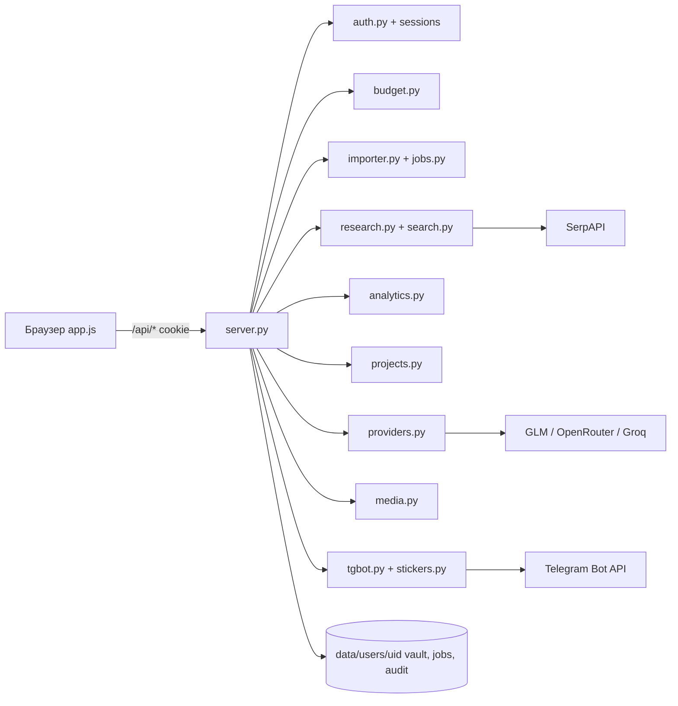

# Моника 1.0 — архитектура нового этапа

> Дополняет ROADMAP.md. Описывает компоненты, потоки данных и модель доверия
> после реализации нового этапа (см. product-spec.md). Стек: Python stdlib +
> vanilla JS, хранение — файлы JSON/MD.

## 1. Компоненты (текущее состояние + новое)

```
Браузер (vanilla JS)
  app/web/index.html, app.js, monica.css, style.css
        │  fetch /api/* (cookie monica_session)
        ▼
app/server.py  ── ThreadingHTTPServer, маршрутизация, HTTPS-опция
  ├─ auth.py        пользователи, PBKDF2, сессии (data/sessions/sessions.json)
  ├─ config.py      config.json: host/port, machine_secret, ssl
  ├─ keys.py        шифрование ключей пользователей машинным секретом
  ├─ providers.py   LLM-провайдеры (glm/smart/luna), chat/chat_stream/ping
  ├─ media.py       Whisper, ffmpeg-кадры, attachments (≤5 × 10МБ)
  ├─ terminal.py    песочница vault: whitelist операций, бэкап перед записью
  ├─ history.py     history.jsonl + undo
  ├─ modules.py     вики: очередь wiki_queue.json, генератор статей
  ├─ onboarding.py  реестр MODELS, валидация онбординга
  └─ tgbot.py       per-user long polling (поток на пользователя)
        │
        ▼
data/
  users/<uid>/  profile.json, vault/, attachments/, history.jsonl,
                tg.json, wiki_queue.json, avatar.*
  sessions/sessions.json
```

### Новые компоненты этапа

| Компонент | Файл (план) | Роль |
|---|---|---|
| Import service | `app/importer.py` | мастер импорта: ZIP/папка, frontmatter, wikilinks, checksum, стратегии конфликтов; фоновая задача |
| Job runner | `app/jobs.py` | идемпотентные фоновые задачи (импорт, nightly digest, backfill); состояние в `data/users/<uid>/jobs/` |
| Budget | `app/budget.py` | дневные лимиты токенов, атомарное резервирование (lock-файл + JSON), разбивка по моделям |
| Audit | `app/audit.py` | append-only `audit.jsonl` per-user |
| Search | `app/search.py` | SearchProvider interface; SerpAPI-адаптер (порт из Сибериады), vault-поиск |
| Research pipeline | `app/research.py` | запросы → кандидаты → извлечение → дедуп → синтез с цитатами; trace этапов |
| Analytics | `app/analytics.py` | агрегаты для heatmap (vault mtime, history.jsonl, сессии); re-auth gate |
| Projects | `app/projects.py` | серверные проекты, роли, приглашения, version history |
| Stickers | `app/stickers.py` | каталог file_id + метаданные (порт из Сибериады) |
| Rate limiter | в `server.py` | in-memory per-IP+uid счётчики |

## 2. Потоки данных

### 2.1 Чат с режимами (обычный / хранилище / сеть)
```
композер (режим, вложения, заметки)
  → POST /api/chat/stream {message, files[], mode}
    → media.analyze_files (vision/whisper)          [если вложения]
    → search.py: vault-индекс или SerpAPI           [если режим ≠ обычный]
    → research.py: пайплайн + trace этапов          [если режим = сеть]
    → providers.chat_stream(service, key, model, messages)
    → SSE-дельты клиенту + trace в панель Process
    → budget.record(uid, model, usage)              [после ответа]
    → audit.log(uid, "chat", meta)
```

### 2.2 Импорт vault
```
мастер (выбор источника, preview, стратегия конфликтов)
  → POST /api/import/start {source, strategy} → job_id
  → jobs.py: фоновая задача importer.run(uid, job_id)
      sha256 → пропуск дублей; frontmatter → метаданные;
      [[wikilinks]] → сохраняются как есть (рендер на фронте)
  → GET /api/import/status?job_id → прогресс, отчёт
  → экспорт: GET /api/profile/export (уже есть) — расширить до полного vault
```

### 2.3 Ночной digest
```
jobs.py: планировщик (поток, проверка раз в минуту)
  → если дата сменилась и задача за вчера не выполнена → daily_knowledge_digest
      ключ идемпотентности: data/users/<uid>/jobs/digest-YYYY-MM-DD.json
      вход: новые заметки/сообщения за день → smart-модель
      выход: vault/Monica/Digests/YYYY-MM-DD.md (provenance в frontmatter)
      история запусков: jobs/history.jsonl; backfill: POST /api/jobs/backfill
```

### 2.4 Совместный проект
```
владелец: POST /api/projects → project_id; POST /api/projects/<id>/invite → код
гость: POST /api/projects/join {code} → роль member (по умолчанию)
чаты/заметки проекта: data/projects/<pid>/chat.jsonl, notes/, history.jsonl
доступ: проверка роли на каждом маршруте (viewer < member < editor < admin < owner)
```

## 3. Модель доверия

Границы (подробно — security-threat-model.md):

1. **Браузер** — недоверенная зона. Все проверки прав — на сервере; cookie
   HttpOnly + SameSite=Lax; сессии с TTL.
2. **Сервер** — доверенное ядро. Единственный, кто читает `machine_secret`
   (расшифровка ключей), валидирует сессии, роли, бюджеты, изоляцию vault.
3. **LLM-провайдеры** — полу-доверенные: получают только необходимый контекст;
   содержимое заметок подаётся как данные (защита от prompt injection).
4. **Telegram** — внешний канал: привязка по одноразовому коду, allowlist
   chat_id, права бота ограничены настройками.
5. **Веб-поиск (SerpAPI)** — недоверенный контент: экранирование, цитаты
   с URL, без исполнения.
6. **Файловая система** — жёсткая изоляция: `data/users/<uid>/vault` — единственная
   записываемая зона пользователя; терминал и импорт не выходят за неё
   (нормализация путей, запрет `..`).

## 4. Совместимость и миграция

- Все новые данные — новые файлы в `data/users/<uid>/` и `data/projects/`;
  существующие profile.json/vault не меняют схему (только добавляются поля).
- `mock_llm: true` продолжает работать для smoke-тестов: новые маршруты
  (research, digest, budget) обязаны иметь mock-поведение.
- Каждый этап — маленькие совместимые изменения; smoke 76/76 после коммита.

## 5. Диаграмма (Mermaid)


